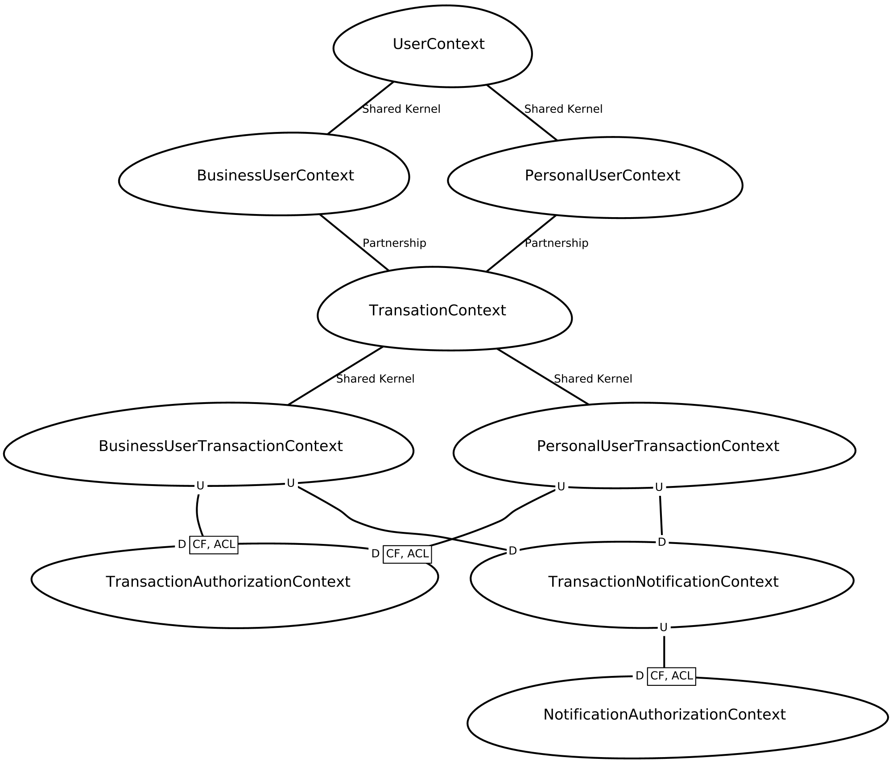

# Summary

[Simple money transaction](#simple-money-transaction)  
[1. Feature Mapping](#1-feature-mapping)  
[2. Running Local](#2-running-local)  
[3. Context Mapping](#3-context-mapping)  
[Development References](#development-references)

# Simple Money Transaction

This is a study case of a system that simulates some usual transactions between users. 

# 1. Feature Mapping

There are only two type of users **Personal** and **Business** and in this system we will implement some features. The current mapped features are listed below. Feature suggestion are welcome feel free to [create a issue](https://github.com/CaioFlavio/simple-money-transaction-system/issues/new) with the _enhancement_ label.

- [ ]  Personal users
  - [ ] Basic Features
    - [x] Register
      - [x] Required Information
        - [x] Full name
        - [x] CPF 
        - [x] E-mail
        - [x] Password
      - [x] Required Restrictions
        - [x] Email should be unique 
        - [x] CPF should be unique
      - [ ] Additional
        - [ ] Email confirmation
    - [x] Login
    - [ ] Transactions
      - [ ] Basic Features
        - [ ] Add funds to the account
        - [ ] Remove funds from the account
        - [ ] Transfer funds to **Personal** users
        - [ ] Transfer funds to **Business** users
        - [ ] Receive funds from **Personal** users
        - [ ] Receive funds from **Business** users
      - [ ] Restrictions
        - [ ] Must have funds to remove funds action
        - [ ] Must have funds to transfer to other accounts
        - [ ] Must validate the transference action using this [data](https://run.mocky.io/v3/8fafdd68-a090-496f-8c9a-3442cf30dae6)
        - [ ] On trasfer fail must return the funds
      - [ ] Notifications
        - [ ] Notify user when a transaction occur
        - [ ] Validate the notify action using this [data](http://o4d9z.mocklab.io/notify)
      - [ ] Additional Features
        - [ ] Apply a defined tax after a defined amount of free transactions

- [ ] Business users
  - [ ] Basic Features
    - [x] Register
      - [x] Required Information
        - [x] Company name
        - [x] CNPJ 
        - [x] E-mail
        - [x] Password
      - [x] Required Restrictions
        - [x] Email should be unique 
        - [x] CNPJ should be unique
      - [ ] Additional
        - [ ] Email confirmation
    - [x] Login
    - [ ] Transactions
      - [ ] Basic Features
        - [ ] Add funds to the account
        - [ ] Remove funds from the account
        - [ ] Receive funds from **Personal** users
        - [ ] Receive funds from **Business** users
      - [ ] Restrictions
        - [ ] Must have funds to remove funds action
        - [ ] Must validate the transference action using this [data](https://run.mocky.io/v3/8fafdd68-a090-496f-8c9a-3442cf30dae6)
        - [ ] On trasfer fail must return the funds
      - [ ] Notifications
        - [ ] Notify user when a transaction occur
        - [ ] Validate the notify action using this [data](http://o4d9z.mocklab.io/notify)
      - [ ] Additional Features
        - [ ] Apply a defined tax when funds are received

# 2. Running Local

## 2.1 System Requirements
  - Git (Tested on version 2.25.1)
    -  If you dont have Git installed [click here](https://git-scm.com/book/en/v2/Getting-Started-Installing-Git) and follow the installation guide.
  - Docker version 20.10.11 or higher (Tested on version 20.10.11)
    - If you dont have docker installed [click here](https://docs.docker.com/engine/install/) and follow the installation guide.

## 2.2 First Steps
  - In your terminal run:
    - git clone git@github.com:caioflavio/smts.git
  - Enter on folder project: 
    - cd smts 
  - On the first run you need create the .env file that have the enviroment variables
    - cp .env.example .env
  - After copied the .env file you can proceed to run the project:
    - ./vendor/bin/sail up
  - By default the project is running on port 8081, it can be changed in .env changing the APP_PORT value.

## 3. Context Mapping
  We will use the following context map to module development of this system. This context map image was generate with [contextmapper.org](https://contextmapper.org/) tool.
  

## 3.1 Explanation
  - The **User Context** allow us manage user creation and handle their shared rules
  - The **Personal User Context** allow us manage the specific rules from personal users.
  - The **Business User Context** allow us manage the specific rules from business users.
    - **Personal User Context** and **Business User Context** depends on **User Context** it makes a Shared Kernel relation.
    - **Personal User Context** and **Business User Context** communnicate each other on transactions then here we must have a paterniship relation and changes must attend each other muttualy.
  - The **Transaction Context** allow us manage general rules for transaction between users.
  - The **Personal User Transaction Context** allow us to handle specific rules for personal users transactions.
  - The **Business User Transaction Context** allow us to handle specific rules for business users transactions.
  - The **Transaction Authorization Context** allow us to handle specific rules for transaction effetivation.
  - The **Transaction Notification Context** allow us to handle specific rules for transaction notification.
      - **Personal User Transaction Context** and **Business User Transaction Context** depends on **Transaction Context** it makes a Shared Kernel relation.
      - **Transaction Notification Context** and **Transaction Authorization Context** depends on external services changes without a previous notification can occour this makes a conformist relationship.
        - We will make a anti corruption layer to each to make the impact of these unwanted changes minimum if they occur.

# Development References
 - [Laravel Framework](https://laravel.com/docs/8.x/installation) - PHP Framework used on development
 - [Laravel Sail](https://laravel.com/docs/8.x/sail) - Laravel's built-in docker container for application start 
 - [Context Mapper Tool](https://contextmapper.org/) - Context mapper drawning tool
 - [DDD Strategic Design](https://blog.jonathanoliver.com/ddd-strategic-design-core-supporting-and-generic-subdomains/) - Article about DDD subdomain types
 - [Bounded Contexts](https://www.eduardopires.net.br/2016/03/ddd-bounded-context/) - Article about DDD bounded contexts